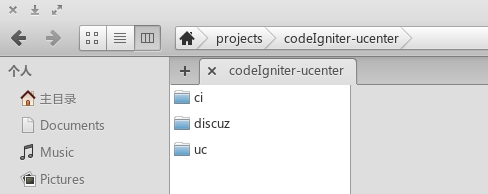
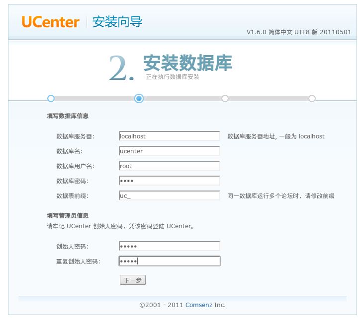
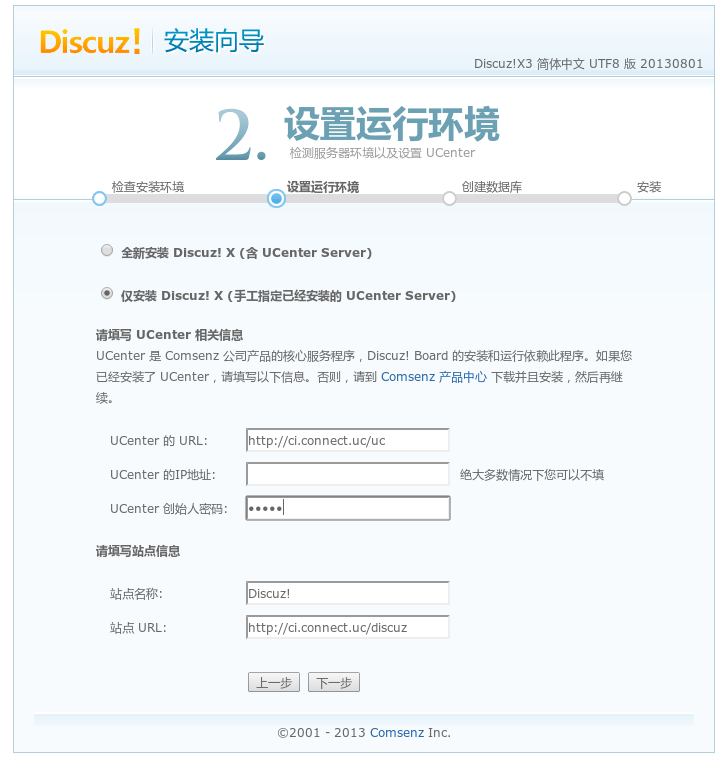
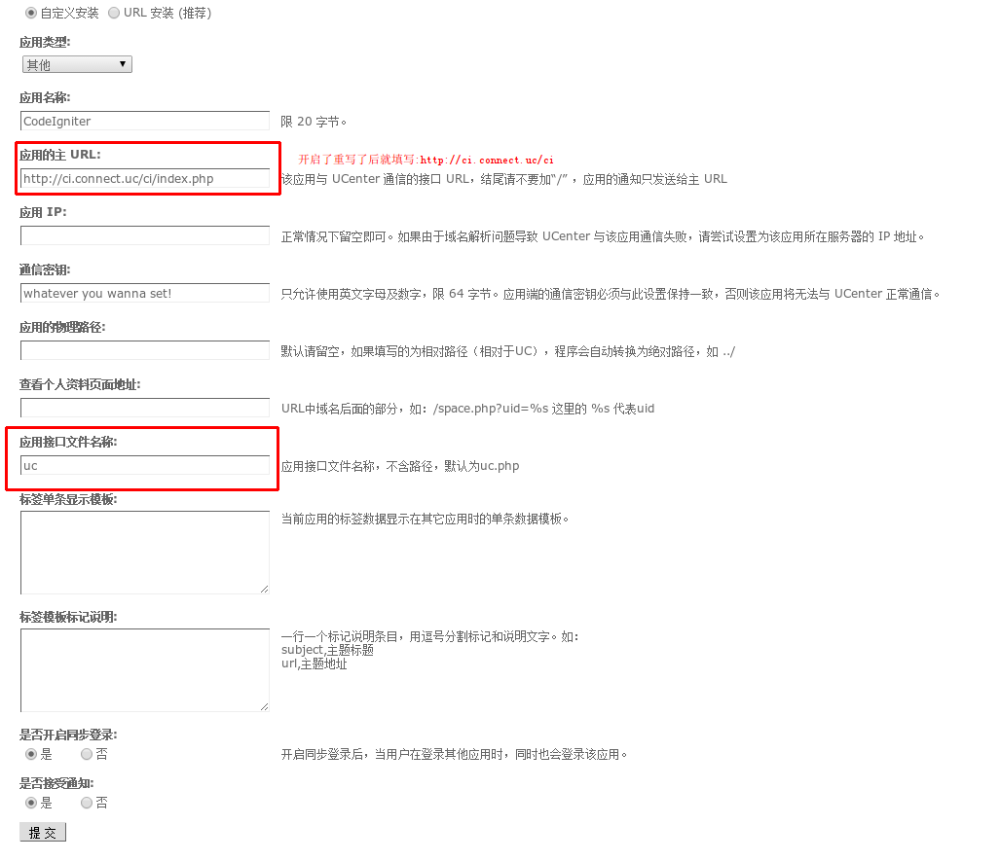
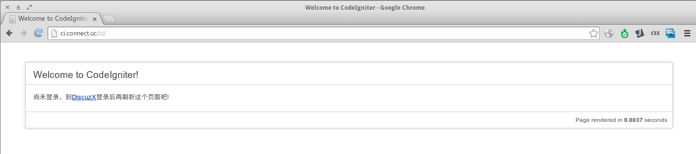
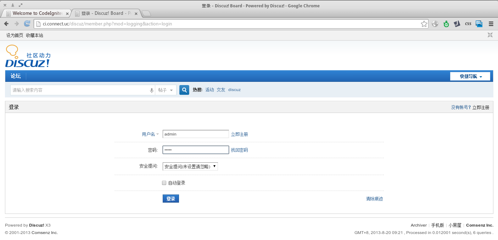
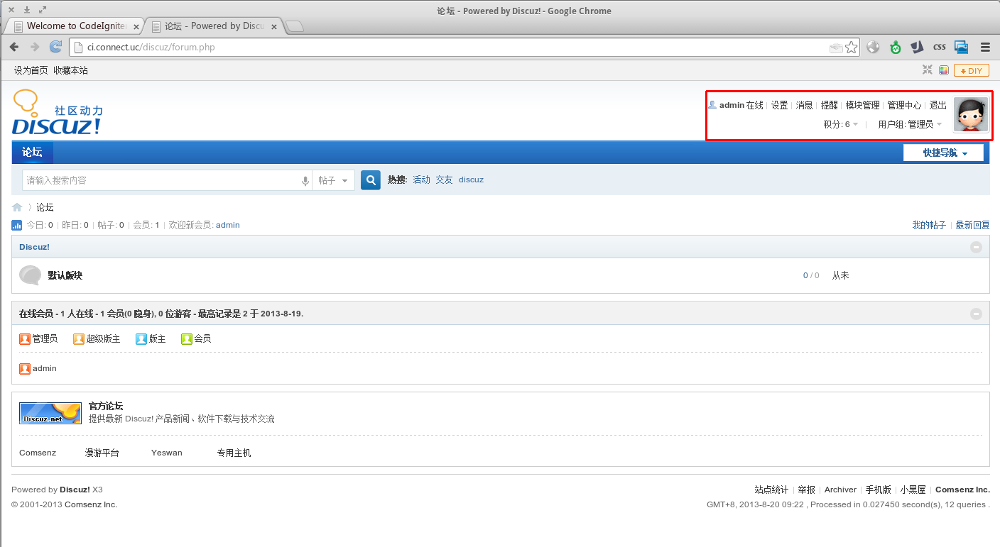
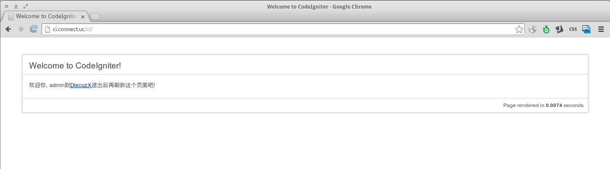
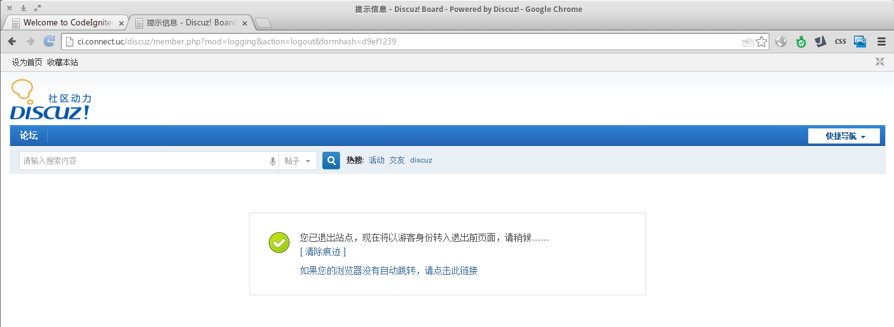
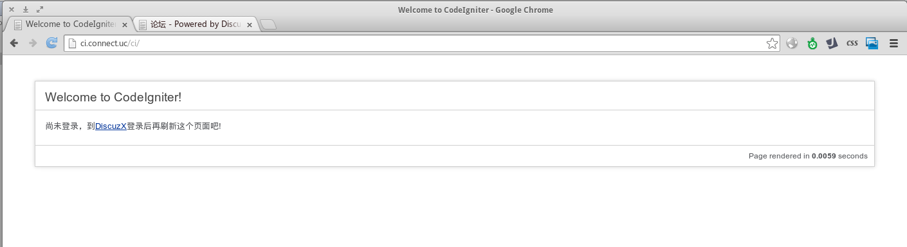

# CodeIgniter 整合 Ucenter 全攻略

> 本文默认你已详细阅读过ucenter官方手册并对CodeIgniter有一定的了解。

## 下载相应的软件

* [CodeIgniter 2.1.4](http://codeigniter.org.cn/download)
* [Ucenter 1.6.0](http://www.comsenz.com/downloads/install/ucenter#down_open)
* [DiscuzX3](http://www.comsenz.com/downloads/install/discuzx)

  简体utf-8,可以不下载Discuz，这里只是用来最后检验同步登录／登出是否成功

## 前置条件

- 项目目录结构如下

  


- 搭建服务器

  根目录指向codeIgniter-ucenter

  我设置了hosts

    ```
    127.0.0.1   ci.connect.uc
    ```

  这个任意的，这里只是为了突出主题.

## 开始集成

- 安装 Ucenter

  访问 http://ci.connect.uc/uc ，按照向导安装即可。

  

- 安装 DiscuzX

  访问 http://ci.connect.uc/discuz ,按照向导，第二步时候选择只安装DiscuzX,如下图,信息填写uc的安装信息

  

- 配置 CodeIgniter

  * 配置application/config.php, 为使用session类，需要设置encryption_key,值任意.

    ```
    $config['encryption_key'] = sha1('whatever it is!');
    ```

  * 修改默认控制器welcome.php如下:

    ```php

    <?php if ( ! defined('BASEPATH')) exit('No direct script access allowed');

        class Welcome extends CI_Controller {

            public function index()
            {
                $this->load->library('session');
                $data['user'] = $this->session->userdata('user');
                $this->load->view('welcome_message', $data);
            }
        }

    ```

  * 修改views/welcome_message.php中的 **div#container** 如下：

     ```html

      <div id="container">
          <h1>Welcome to CodeIgniter!</h1>
          <div id="body">
              <?php if ($user): ?>
                  <p>欢迎你, <?php echo $user['username']; ?>到<a target="_blank" href="http://ci.connect.uc/discuz">DiscuzX</a>退出后再刷新这个页面吧!</p>
              <?php else: ?>
                  <p>尚未登录，到<a target="_blank" href="http://ci.connect.uc/discuz">DiscuzX</a>登录后再刷新这个页面吧!</p>
              <?php endif; ?>
          </div>
          <p class="footer">Page rendered in <strong>{elapsed_time}</strong> seconds</p>
      </div>

     ```

  * 在Ucenter中添加新应用

    看图：
    

  * 在CI目录application/config/目录下新建文件ucenter.php

    内容为Ucenter为新加应用生成的配置文件

    ```php

    <?php
        define('UC_CONNECT', 'mysql');
        define('UC_DBHOST', 'localhost');
        define('UC_DBUSER', 'root');
        define('UC_DBPW', 'root');
        define('UC_DBNAME', 'ucenter');
        define('UC_DBCHARSET', 'utf8');
        define('UC_DBTABLEPRE', '`ucenter`.uc_');
        define('UC_DBCONNECT', '0');
        define('UC_KEY', 'whatever you wanna set!');
        define('UC_API', 'http://ci.connect.uc/uc');
        define('UC_CHARSET', 'utf-8');
        define('UC_IP', '');
        define('UC_APPID', '2');
        define('UC_PPP', '20');

    ```

    * 从uc安装包中复制uc_client到ci根目录

    * 新增控制器api/uc.php

      内容如下：

      ```php

      <?php if ( ! defined('BASEPATH')) exit('No direct script access allowed');
  
      /**
       *  Ucenter接口通知处理控制器
       *
       *  本类根据ucenter提供的通知处理实例代码编写，具体处理部分需要根据不同应用的逻辑自行编写处理逻辑。
       *  具体请仔细阅读ucenter自带的手册。
       *
       *  @author     chekun <234267695@qq.com>
       */
  
      class Uc extends CI_Controller
      {
          const UC_CLIENT_RELEASE = '20110501';
          const UC_CLIENT_VERSION = '1.6.0';
  
          const API_DELETEUSER = 1;
          const API_RENAMEUSER = 1;
          const API_GETTAG = 1;
          const API_SYNLOGIN = 1;
          const API_SYNLOGOUT = 1;
          const API_UPDATEPW = 1;
          const API_UPDATEBADWORDS = 1;
          const API_UPDATEHOSTS = 1;
          const API_UPDATEAPPS = 1;
          const API_UPDATECLIENT = 1;
          const API_UPDATECREDIT = 1;
          const API_GETCREDITSETTINGS = 1;
          const API_GETCREDIT = 1;
          const API_UPDATECREDITSETTINGS = 1;
  
          const API_RETURN_SUCCEED = 1;
          const API_RETURN_FAILED = -1;
          const API_RETURN_FORBIDDEN = -2;
  
          public function index()
          {
              include APPPATH.'config/ucenter.php';
              $get = $post = array();
              $code = $this->input->get('code', true);
              parse_str(static::authcode($code, 'DECODE', UC_KEY), $get);
              $timestamp = time();
              if ($timestamp - $get['time'] > 3600)
              {
                  echo '授权已过期';
                  return;
              }
              if (empty($get))
              {
                  echo '非法请求';
                  return;
              }
              $post = static::unserialize(file_get_contents('php://input'));
              if (in_array($get['action'], array(
                  'test',
                  'deleteuser',
                  'renameuser',
                  'gettag',
                  'synlogin',
                  'synlogout',
                  'updatepw',
                  'updatebadwords',
                  'updatehosts',
                  'updateapps',
                  'updateclient',
                  'updatecredit',
                  'getcreditsettings',
                  'updatecreditsettings')))
              {
  
                  echo $this->$get['action']($get, $post);
                  return;
              }
              else
              {
                  echo static::API_RETURN_FAILED;
                  return;
              }
  
          }
  
          private function test($get, $post)
          {
              return static::API_RETURN_SUCCEED;
          }
  
          private function deleteuser($get, $post)
          {
              if ( ! static::API_DELETEUSER)
              {
                  return static::API_RETURN_FORBIDDEN;
              }
              $uids = $get['ids'];
              //delete your users here
              return static::API_RETURN_SUCCEED;
          }
  
          private function gettag($get, $post)
          {
              if ( ! static::API_GETTAG)
              {
                  return static::API_RETURN_FORBIDDEN;
              }
              //
              return static::API_RETURN_SUCCEED;
          }
  
          private function synlogin($get, $post)
          {
              if ( ! static::API_SYNLOGIN)
              {
                  return static::API_RETURN_FORBIDDEN;
              }
              header('P3P: CP="CURa ADMa DEVa PSAo PSDo OUR BUS UNI PUR INT DEM STA PRE COM NAV OTC NOI DSP COR"');
              $uid = $get['uid'];
              //同步登录的代码在这里处理
              include APPPATH.'../uc_client/client.php';
              if ($uc_user = uc_get_user($uid, 1))
              {
                  $this->load->library('session');
                  $this->session->set_userdata('user', array(
                      'uid' => $uid,
                      'username' => $uc_user[1]
                  ));
              }
  
              return static::API_RETURN_SUCCEED;
          }
  
          private function synlogout($get, $post)
          {
              if ( ! static::API_SYNLOGOUT)
              {
                  return static::API_RETURN_FORBIDDEN;
              }
              header('P3P: CP="CURa ADMa DEVa PSAo PSDo OUR BUS UNI PUR INT DEM STA PRE COM NAV OTC NOI DSP COR"');
              $this->load->library('session');
              $this->session->sess_destroy();
              return static::API_RETURN_SUCCEED;
          }
  
          private function updatepw($get, $post)
          {
              if ( ! static::API_UPDATEPW)
              {
                  return static::API_RETURN_FORBIDDEN;
              }
              //这里做修改密码操作
              return static::API_RETURN_SUCCEED;
          }
  
          private function updatebadwords($get, $post)
          {
              if ( ! static::API_UPDATEBADWORDS)
              {
                  return static::API_RETURN_FORBIDDEN;
              }
              $cachefile = APPPATH.'../uc_client/data/cache/badwords.php';
              @unlink($cachefile);
              return static::API_RETURN_SUCCEED;
          }
  
          private function updatehosts($get, $post)
          {
              if ( ! static::API_UPDATEHOSTS)
              {
                  return static::API_RETURN_FORBIDDEN;
              }
              $cachefile = APPPATH.'../uc_client/data/cache/hosts.php';
              @unlink($cachefile);
              return static::API_RETURN_SUCCEED;
          }
  
          private function updateapps($get, $post)
          {
              if ( ! static::API_UPDATEAPPS)
              {
                  return static::API_RETURN_FORBIDDEN;
              }
              $cachefile = APPPATH.'../uc_client/data/cache/apps.php';
              @unlink($cachefile);
              return static::API_RETURN_SUCCEED;
          }
  
          private function updateclient($get, $post)
          {
              if ( ! static::API_UPDATECLIENT)
              {
                  return static::API_RETURN_FORBIDDEN;
              }
              $cachefile = APPPATH.'../uc_client/data/cache/settings.php';
              @unlink($cachefile);
              return static::API_RETURN_SUCCEED;
          }
  
          private function updatecredit($get, $post)
          {
              if ( ! static::API_UPDATECREDIT)
              {
                  return static::API_RETURN_FORBIDDEN;
              }
              return static::API_RETURN_SUCCEED;
          }
  
          private function getcredit($get, $post)
          {
              if ( ! static::API_GETCREDIT)
              {
                  return static::API_RETURN_FORBIDDEN;
              }
              return static::API_RETURN_SUCCEED;
          }
  
          public static function authcode($string, $operation = 'DECODE', $key = '', $expiry = 0)
          {
              $ckey_length = 4;
              $key = md5($key ? $key : UC_KEY);
              $keya = md5(substr($key, 0, 16));
              $keyb = md5(substr($key, 16, 16));
              $keyc = $ckey_length ? ($operation == 'DECODE' ? substr($string, 0, $ckey_length): substr(md5(microtime()), -$ckey_length)) : '';
  
              $cryptkey = $keya.md5($keya.$keyc);
              $key_length = strlen($cryptkey);
  
              $string = $operation == 'DECODE' ? base64_decode(substr($string, $ckey_length)) : sprintf('%010d', $expiry ? $expiry + time() : 0).substr(md5($string.$keyb), 0, 16).$string;
              $string_length = strlen($string);
  
              $result = '';
              $box = range(0, 255);
  
              $rndkey = array();
              for($i = 0; $i <= 255; $i++)
              {
                  $rndkey[$i] = ord($cryptkey[$i % $key_length]);
              }
  
              for($j = $i = 0; $i < 256; $i++)
              {
                  $j = ($j + $box[$i] + $rndkey[$i]) % 256;
                  $tmp = $box[$i];
                  $box[$i] = $box[$j];
                  $box[$j] = $tmp;
              }
  
              for($a = $j = $i = 0; $i < $string_length; $i++)
              {
                  $a = ($a + 1) % 256;
                  $j = ($j + $box[$a]) % 256;
                  $tmp = $box[$a];
                  $box[$a] = $box[$j];
                  $box[$j] = $tmp;
                  $result .= chr(ord($string[$i]) ^ ($box[($box[$a] + $box[$j]) % 256]));
              }
  
              if($operation == 'DECODE')
              {
                  if((substr($result, 0, 10) == 0 || substr($result, 0, 10) - time() > 0) && substr($result, 10, 16) == substr(md5(substr($result, 26).$keyb), 0, 16))
                  {
                      return substr($result, 26);
                  }
                  else
                  {
                      return '';
                  }
              }
              else
              {
                  return $keyc.str_replace('=', '', base64_encode($result));
              }
          }
  
          public static function serialize($arr, $htmlOn = 0)
          {
              if ( ! function_exists('xml_serialize'))
              {
                  require APPPATH.'../uc_client/lib/xml.class.php';
              }
              return xml_serialize($arr, $htmlOn);
          }
  
          public static function unserialize($xml, $htmlOn = 0)
          {
              if ( ! function_exists('xml_serialize'))
              {
                  require APPPATH.'../uc_client/lib/xml.class.php';
              }
              return xml_unserialize($xml, $htmlOn);
          }
  
          public static function gbk2utf8($string)
          {
              return iconv("GB2312", "UTF-8//IGNORE", $string);
          }
  
          public static function utf82gbk($string)
          {
              return iconv("UTF-8", "GB2312//IGNORE", $string);
          }
  
      }

      ```

## 运行


* 打开 http://ci.connect.uc/ci

  

* 点击页面链接进行登录操作

  

  

* 刷新即可看到已登录

  

* 点击页面链接进行退出操作

  

* 再次刷新即可看到已退出

  

> 你还可以打开demo.ogv来观看演示程序的运行视频。

  <video width="750" height="" controls="true" autoplay="false" name="media"><source src="demo.ogv" type="video/ogg"></video>


本教程不含自带用户数据库的情况下，在自有用户表的情况下，处理逻辑类似，要有一个字段记录ucenter的唯一用户id，同步登录和退出的逻辑里使用该id进行相应的操作。

有任何问题请发issues。
